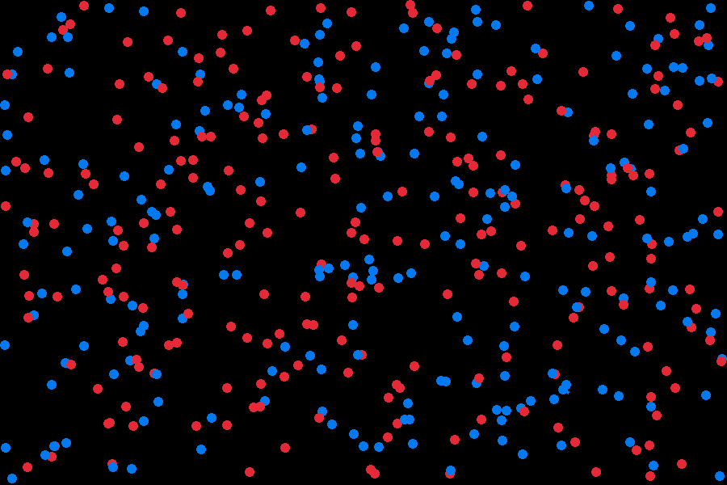

# ⚡ Coulomb Force Simulation





A real-time physics simulation of **500 charged particles** interacting via Coulomb's law, visualized with Raylib.


## 🔬 Physics Concepts Implemented


| Concept | Implementation |

|---------|----------------|

| **Coulomb's Law** | `F = k·q₁·q₂/r²` with distance clamping (`r² < 1`) to prevent singularity explosions |

| **Vector Decomposition** | Unit vectors: `nx = dx/d`, `ny = dy/d` to split force into x/y components |

| **Force Accumulation** | Pattern: `ResetForces()` → `ComputeForces()` → `UpdateCharges()` |

| **Numerical Integration** | Semi-implicit Euler method for stability (velocity updated before position) |

| **Charge Distribution** | 50% negative (blue), 50% positive (red) charges |


## 🛠️ Build & Run


```bash

# Install Raylib first: https://www.raylib.com/

make

./coulomb-sim

## Controls

- Press `S` to save screenshot (`screenshot.png`)
- Close window to exit


## License

MIT License
